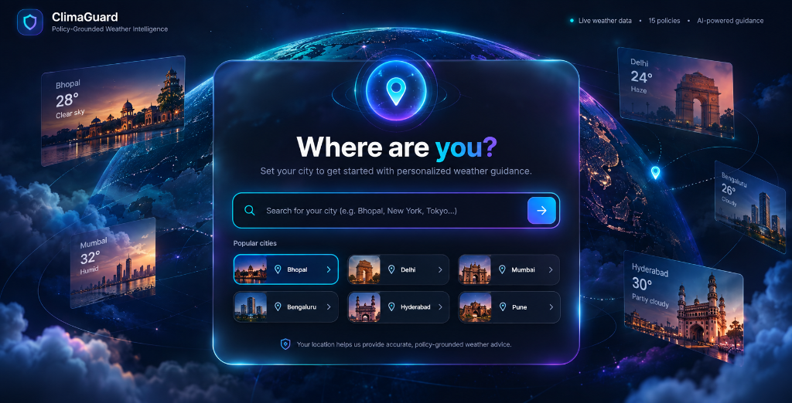
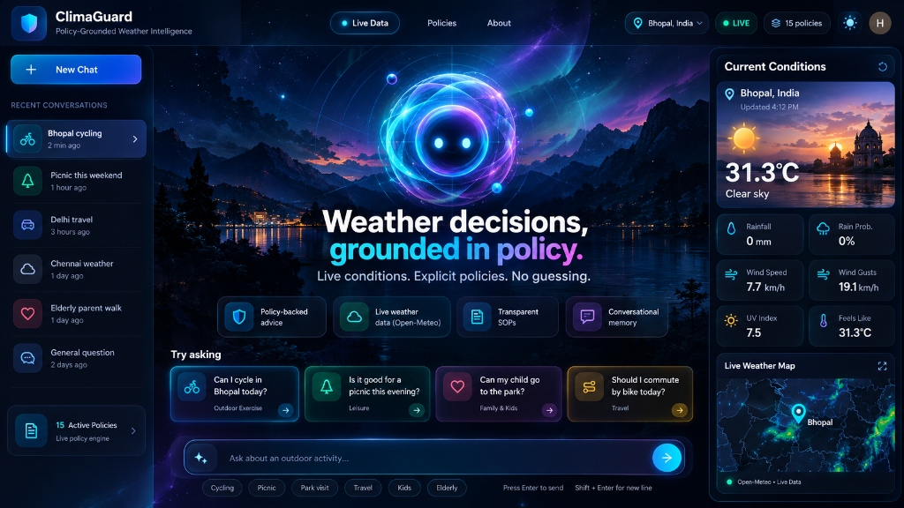
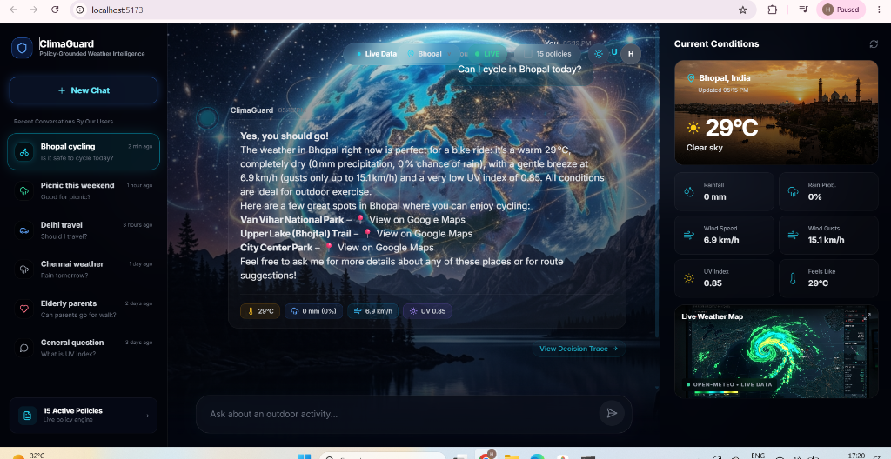

<div align="center">
  
  

  # ClimaGuard
  **Policy-Grounded Weather Intelligence**

  <p>
    Live conditions. Explicit policies. No guessing.
  </p>

  <div>
    
    
    
    
    
  </div>

  <br />
  
  <h3><a href="https://weather-advisory-support-bot.vercel.app">🔴 Live Demo</a></h3>

</div>

---

## 🌪️ Overview

**ClimaGuard** is a premium, futuristic AI weather intelligence product designed to bridge the gap between raw meteorological data and actionable human safety. Unlike generic chatbots that hallucinate advice or basic weather dashboards that leave interpretation up to the user, ClimaGuard evaluates **live weather conditions** against a **deterministic safety policy engine** to provide definitive, transparent recommendations.

If there's no policy for it, ClimaGuard won't guess. 

---

## ✨ Features

- **Policy-Grounded Decision Engine:** AI advice is strictly bound by deterministic standard operating procedures (SOPs).
- **Live Meteorological Data:** Real-time integration with Open-Meteo for hyper-accurate, localized weather stats.
- **Cinematic AI Interface:** A deeply immersive, neon-glassmorphism UI that feels like a command center.
- **Transparent Decision Tracing:** Users can click "How this answer was decided" to see the exact AI thought pipeline, matching policies, and logic trace.
- **Dynamic 3D City Visualization:** Experience your chosen city with stunning contextual hero images and floating weather cards.

---

## 📸 Interface Showcase

### Cinematic Onboarding & Location Selection
<p align="center">
  
</p>

### AI Command Center
<p align="center">
  
</p>

### Interactive Policy-Grounded Chat
<p align="center">
  
</p>

---

## 🏗️ Architecture

The product is split into two robust halves:

### 1. Frontend (`/frontend`)
- **Framework:** React + Vite
- **Language:** TypeScript
- **Styling:** Tailwind CSS + custom glassmorphism utilities
- **Animations:** Framer Motion (for fluid, physical interactions)
- **Icons:** Lucide React

### 2. Backend (`/backend`)
- **Framework:** FastAPI
- **Language:** Python
- **AI/LLM Engine:** LangGraph (structured AI reasoning and orchestration)
- **Weather Provider:** Open-Meteo API
- **Policy Engine:** Custom deterministic SOP matching system

---

## 🚀 Getting Started

### Prerequisites
- Node.js (v18+)
- Python (3.9+)

### Running the Backend

```bash
cd backend
python -m venv venv
source venv/bin/activate  # Or `venv\Scripts\activate` on Windows
pip install -r requirements.txt
uvicorn app.main:app --reload --port 8000
```

### Running the Frontend

```bash
cd frontend
npm install
npm run dev
```

The application will be available at `http://localhost:5173`.

---

<div align="center">
  <p>Built with precision for safety, transparency, and design.</p>
</div>
