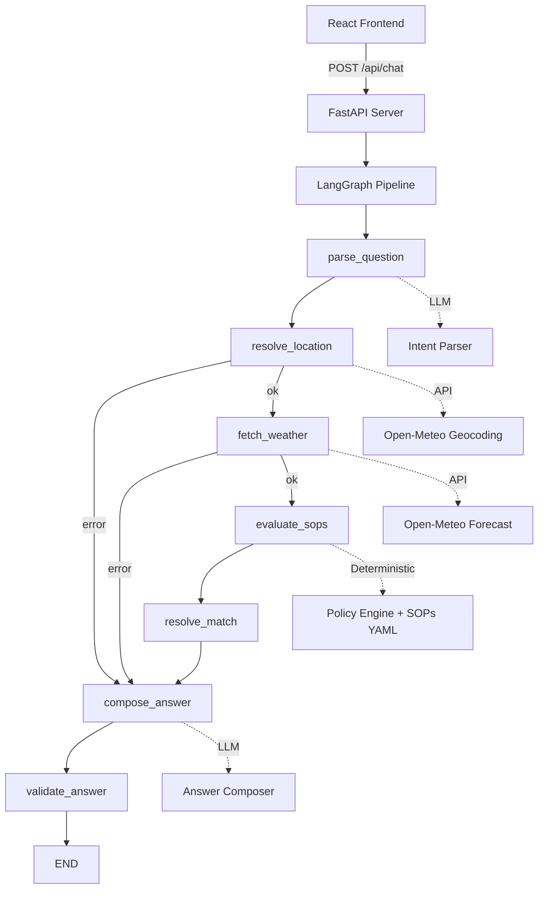

# ClimaGuard — Architecture

## Overview

ClimaGuard is a policy-grounded weather advisory system for outdoor activities. It fetches live weather data, matches conditions against predefined Standard Operating Procedures (SOPs), and generates human-readable advice — all while ensuring the LLM never decides safety.

## System Architecture



## Component Responsibilities

### 1. React Frontend
- Premium dark-themed chat interface
- Weather data panel (right sidebar)
- Policy trace UI for transparency
- Session management
- Responsive layout (desktop-first, mobile-friendly)

### 2. FastAPI Server
- `/api/chat` — main conversation endpoint
- `/api/session/new` — session creation
- `/health` — health check with SOP count
- `/api/sops` — list loaded SOPs
- CORS middleware for development
- Static file serving for production builds
- In-memory session store

### 3. LangGraph Pipeline

The pipeline is a **real graph** with genuine node boundaries and conditional branches:

| Node | Responsibility | Uses LLM? |
|------|---------------|-----------|
| `parse_question` | Extract activity, location, time from natural language | ✅ Structured extraction |
| `resolve_location` | Geocode city → lat/lon via Open-Meteo | ❌ Deterministic API |
| `fetch_weather` | Fetch current + hourly weather from Open-Meteo | ❌ Deterministic API |
| `evaluate_sops` | Match SOPs against weather + intent | ❌ Fully deterministic |
| `resolve_match` | Set success/no_policy status | ❌ Fully deterministic |
| `compose_answer` | Generate human-readable response | ✅ Grounded composition |
| `validate_answer` | Verify answer integrity | ❌ Deterministic checks |

### 4. Weather Service
- Open-Meteo Geocoding API for location resolution
- Open-Meteo Forecast API for current + hourly weather
- Normalized `WeatherData` model with all required fields
- Custom error hierarchy: `LocationResolutionError`, `WeatherFetchError`, `WeatherDataValidationError`
- `WeatherClientProtocol` abstract class for dependency injection (testing)
- Time window support: current, morning, afternoon, evening, tomorrow

### 5. Policy Engine (Deterministic)
- Loads SOPs from `data/sops.yaml` at startup
- Activity matching: direct keyword, category, substring, audience-specific
- Condition evaluation: all conditions in an SOP must be met (AND logic)
- Conflict resolution: highest severity first, then highest priority
- No LLM involvement — purely code-driven decisions

### 6. LLM Service
- Provider-agnostic: supports OpenAI and Anthropic
- **Intent Parsing**: structured JSON extraction with validation
- **Answer Composition**: receives only structured facts (WeatherData + PolicyDecision)
- System prompts explicitly forbid inventing weather data or SOPs
- Deterministic fallback if LLM fails

### 7. Session Memory
- In-memory dict keyed by `session_id`
- Stores: activity, category, audience, location from last interaction
- Follow-up questions reuse context (e.g., "What about this evening?" reuses location and activity)
- Resets when user clears session or creates a new one
- **Trade-off**: No persistence across server restarts (acceptable for MVP)

## Data Flow

```
User Query
  → [LLM] Parse intent → {activity, location, time_window, audience}
  → [API] Geocode location → {lat, lon, city, country}
  → [API] Fetch weather → WeatherData{temp, precip, wind, uv, ...}
  → [Engine] Evaluate SOPs → PolicyDecision{matching[], selected, reason}
  → [LLM] Compose answer using ONLY WeatherData + PolicyDecision
  → [Engine] Validate answer integrity
  → Structured ChatResponse to frontend
```

## Why Decisions Are Deterministic vs. LLM

| Decision | Owner | Rationale |
|----------|-------|-----------|
| "What is the user asking?" | LLM | Natural language understanding |
| "What's the weather?" | Open-Meteo API | Facts must come from a real source |
| "Which SOP applies?" | Policy Engine | Safety rules must be auditable |
| "Which SOP wins?" | Priority/Severity sort | Must be predictable and traceable |
| "Is this activity safe?" | SOP conditions | Threshold-based, not opinion-based |
| "How to say it nicely?" | LLM | Conversational polish only |

## Failure Paths

1. **Location Error**: `resolve_location` → skip weather/SOPs → honest message
2. **Weather Error**: `fetch_weather` → skip SOPs → honest message about unavailability
3. **No SOP Match**: Pipeline completes → returns weather data + explicit "no policy" message
4. **LLM Failure**: Deterministic fallback answers using structured data
5. **Validation Failure**: Replace answer with safe fallback
6. **Adversarial Input**: Policy engine ignores user claims about SOPs/weather

## Security Boundaries

- API keys server-side only, never in frontend
- LLM prompts explicitly instruct against fabrication
- User input is treated as untrusted text
- Only `data/sops.yaml` and Open-Meteo responses are authoritative
- Answer validation catches fabricated SOP references
